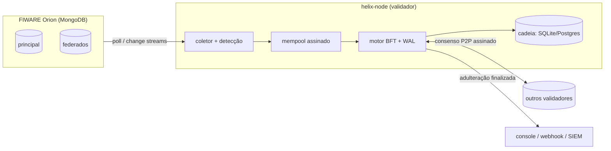

# Helix Blockchain

**Ledger permissionado com consenso BFT** para garantir a **integridade** —
à prova de adulteração e acordada por múltiplos nós — dos dados dos brokers
FIWARE Orion (Helix Sandbox Next Generation), no cenário de IoT.

[](https://github.com/Martinez1991/helixBlockchain/actions/workflows/build.yml)
[](https://github.com/Martinez1991/helixBlockchain/actions/workflows/security.yml)


---

## Sobre

O Helix opera em conjunto com o Helix Sandbox NG para garantir a **integridade**
dos dados dos brokers. Ele **não cifra** os dados — garante *integridade*, não
confidencialidade. Vários **validadores** chegam a um **consenso BFT** sobre cada
observação e a registram numa cadeia tamper-evident.

Se um agente malicioso inserir ou alterar dados diretamente nos brokers
**federados**, isso é detectado comparando-os com o broker principal e — após ser
**finalizado por consenso** — notificado (qual dispositivo foi adulterado).

> A versão original (TCC) era um hash-chain de nó único com Proof-of-Work. A
> reescrita **v2** introduziu consenso **BFT real** (IBFT/PBFT), Ed25519 e Merkle;
> a **v0.3.0** adicionou o endurecimento de produção (ver
> [CHANGELOG](CHANGELOG.md)). Código original preservado em [`legacy/`](legacy/).

## Recursos

- **Consenso BFT (IBFT/PBFT)** — proposer em rodízio, quórum `N − f`, tolera `f`
  de `3f+1` bizantinos; **round-change** seguro com certificados.
- **Integridade criptográfica** — SHA-256, **Ed25519**, **Merkle**, certificado
  de finalidade; **prova de inclusão** verificável offline (`/proof`).
- **Detecção de adulteração** entre broker principal e federados (FIWARE Orion).
- **Crash-recovery seguro** — WAL de votos (anti-equivocação).
- **Registros assinados** — anti-injeção no mempool.
- **Membership dinâmico on-chain** + **descoberta de peers** + **bootstrap de genesis**.
- **Segurança** — token de cluster (rotação), **TLS/mTLS**, segredos via arquivo,
  rate limiting/backpressure, trilha de auditoria.
- **Observabilidade** — métricas Prometheus, dashboard Grafana, alertas, tracing
  OpenTelemetry; **notificações** webhook/Slack/SIEM.
- **Operação** — Docker (non-root), **Helm** com HA, Postgres/SQLite, backup.

## Como funciona

Cada processo `helix-node` é um validador que monitora o Orion, detecta
adulteração e participa do consenso para finalizar registros de integridade na
cadeia compartilhada.



- Tolera até `f = (N−1)/3` validadores maliciosos (quórum `N − f`; use **4 nós**
  para `f=1`). Finalidade imediata (sem mineração/PoW).
- Protocolo e modelo detalhados em [docs/architecture.md](docs/architecture.md).

## Início rápido (Docker)

```bash
python scripts/gen_dev_secrets.py     # gera .env (gitignored) com chaves+token de DEV
docker compose up --build             # Mongo + Orion + 3 validadores
```

Dispare um round de consenso e inspecione (token do `.env`):

```bash
TOKEN=$(grep CLUSTER_TOKEN .env | cut -d= -f2)
curl -s -H "Authorization: Bearer $TOKEN" -X POST localhost:8001/admin/submit?count=2
curl -s localhost:8001/chain          # height/quorum/validadores (leitura, aberto)
```

**Console web** (read-only): abra **http://localhost:8001/ui** — board do cluster,
explorer de blocos, feed de adulterações e verificador de prova de Merkle no
navegador. (Para métricas/alertas, use Grafana + Prometheus em [`ops/`](ops/).)

## Início rápido (local)

```bash
python -m venv .venv && source .venv/bin/activate   # Windows: .venv\Scripts\activate
pip install -e ".[dev]"

python -m helix_blockchain.tools.keygen node-1 127.0.0.1:8000   # gera identidade
cp .env.example .env                                            # cole chave + peers

pytest            # suíte de testes (183)
ruff check src tests
helix-node        # inicia o nó
```

## Documentação

| Documento | Conteúdo |
|---|---|
| [docs/](docs/README.md) | Índice da documentação |
| [Arquitetura](docs/architecture.md) | Camadas, consenso BFT, round-change, membership, segurança |
| [Configuração](docs/configuration.md) | Referência de todas as variáveis `HELIX_*` |
| [API HTTP](docs/api.md) | Endpoints P2P, leitura, prova Merkle, admin |
| [Segurança](docs/security.md) | Auth, TLS/mTLS, assinaturas, WAL, rate limiting, segredos |
| [Observabilidade](docs/observability.md) | Métricas, alertas, dashboards, tracing |
| [Operação](docs/operations.md) | Persistência, backup, retenção, restore |
| [Instalação](docs/installation.md) · [Requisitos](docs/requirements.md) | Setup manual e Docker |
| [Desenvolvimento](docs/development.md) | Ambiente, testes, contribuição |
| [Compliance](docs/compliance/) | LGPD, classificação de dados, ISO/SOC2 |
| [Helm](deploy/helm/helix/README.md) · [Verificação formal](specs/README.md) | Deploy HA · TLA+/fuzzing |

## Stack

Python 3.11+, FastAPI/uvicorn, httpx, SQLAlchemy (SQLite/Postgres), pymongo,
cryptography (Ed25519), prometheus-client, OpenTelemetry.

## Licença

MIT. **Conheça o Helix Sandbox NG:** [gethelix.org](https://gethelix.org).
